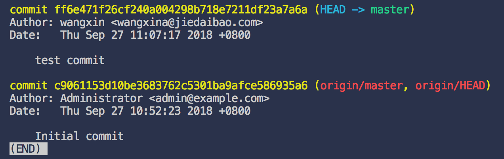
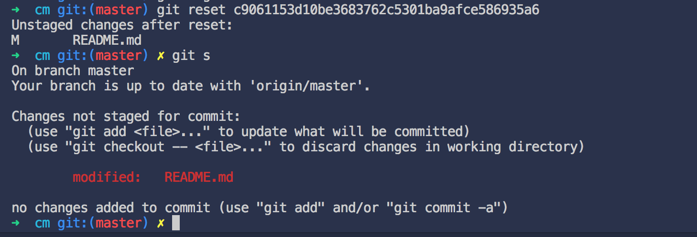
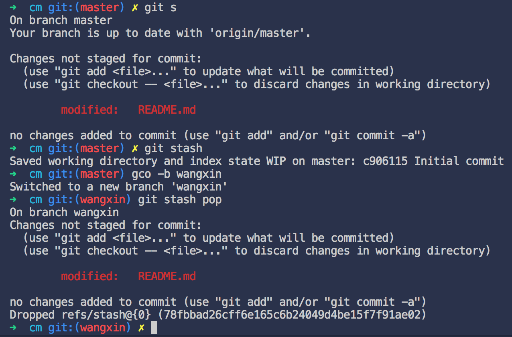
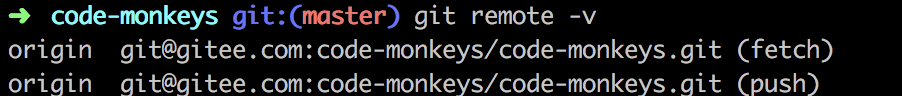
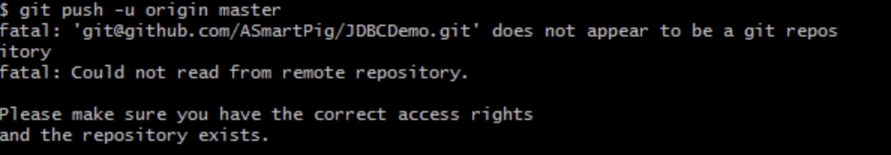

# Handy Note

## DB

Use navicat11 client to connect localhost mysql database and get 
`Client does not support authentication protocol requested by server; consider upgrading MySQL client`

```
ALTER USER 'root'@'localhost' IDENTIFIED WITH mysql_native_password BY 'newpass';
```

## IDE

### idea2018 active code

```
http://idea.lanyus.com/
```

### IDEA crack

- https://www.jianshu.com/p/3c87487e7121
- http://idea.lanyus.com/
- https://www.jianshu.com/p/3c87487e7121
- https://www.liangzl.com/get-article-detail-114916.html

### use zsh as the default shell

1. Open `User Settings` and search `terminal.integrated.shell.osx`

2. Set it to `/bin/zsh`

### use `code` command to open a project with vscode quickly in shell

1. `Command+Shift+P` and search `shell command`

2. Choose `Install 'code' command in PATH`

### preview markdown file real time in vscode

1. `Command+Shift+P` and search `markdown`

2. Choose `Open locked preview to the side`

### vscode避免打开新的文件覆盖当前文件

> 因为默认设置是预览文件，需要把预览文件设置为false

```
"workbench.editor.enablePreview": false
```

## Maven 

### 环境变量

```
vim ~/.bash_profile
export M2_HOME=/Users/username/Documents/maven #这里是你maven的路径
export PATH=$PATH:$M2_HOME/bin
source ~/.bash_profile

mvn -v
```

### 插件使用

- [maven-install-plugin](http://maven.apache.org/plugins/maven-install-plugin/usage.html)
- [maven-install-plugin/examples](http://maven.apache.org/plugins/maven-install-plugin/examples/specific-local-repo.html)

### 插件问题

- [maven-plugins-can-not-be-found-in-intellij](https://stackoverflow.com/questions/20496239/maven-plugins-can-not-be-found-in-intellij/27168770)

## Linux

### 查看Linux系统版本

```
lsb_release -a
```
lsb = Linux Standard Base

### CPU使用情况

```
top
```

### CPU信息

```
cat /proc/cpuinfo |more
```

### 查看内存

```
free -m
```

### 查看磁盘

```
df -h
```

```
fdisk -l
```

### 查看端口占用

```
netstat -lnp | grep 3306
```

```
netstat -tunlp | grep 18706
```

显示如下

```
tcp        0      0 0.0.0.0:18706           0.0.0.0:*               LISTEN      15957/python        
udp        0      0 0.0.0.0:18706           0.0.0.0:*                           15957/python
```

如果centos提示未安装netstat，可通过`yum install net-tools`进行安装，然后查看某个端口是否被占用

### 远程传输(将本地文件传输至远端服务器)

```
scp -(P sshPort) /home/lnmp0.4.tar.gz root@hostOrIp:/root/
```

注意点:
1. 参数`-P`的`P`为**大写**，可选参数，用于指定`ssh`端口
2. 远程地址后有冒号
3. 远程位置如果为目录，需要以`/`结尾
4. 本地拷贝源可为文件或目录，目录需要结尾加`/`

### 下载文件

1. curl

```
curl -o ZenTaoPMS.10.4.stable.int.zbox_64.tar.gz http://dl.cnezsoft.com/zentao/10.4/ZenTaoPMS.10.4.stable.int.zbox_64.tar.gz
```
需要使用`-o`参数指定资源输出到文件而非输出到控制台，并且指定输出到的文件名，否则会提示

```
curl: no URL specified!
curl: try 'curl --help' or 'curl --manual' for more information
```

2. wget

```
wget http://dl.cnezsoft.com/zentao/10.4/ZenTaoPMS.10.4.stable.int.zbox_64.tar.gz
```

### 命令解读

#### which&where
- [which & whereis](https://superuser.com/questions/40301/which-whereis-differences)

#### /usr/bin和/usr/local/bin区别
- [/usr/bin & /usr/local/bin](https://unix.stackexchange.com/questions/259231/difference-between-usr-bin-and-usr-local-bin)

### 多机器部署

- [多机器部署](http://blog.51cto.com/yifangyou/610305)

## MacOS

### use zsh as the default shell

1. See the shells you already installed with the command

```code
cat /etc/shells
```

2. Set zsh as the default shell

```
chsh -s /usr/local/bin/zsh
```

3. (Optional)If you want to configure zsh mannually, use

```
vim ~/.zshrc
```

4. After change `.zshrc`, do remember to `source` it to make it work

```
source ~/.zshrc
```

5. (Restore default shell)

```
chsh -s /bin/bash
```

### Java默认Home
```
/Library/Java/JavaVirtualMachines
```

### 锁屏快捷键

```
control+command+q
```

### 软件下载

- [xclient](http://xclient.info/s/cornerstone.html?t=8f960294b8e049699cd802d64b936303be440b3d#versions)

## Vim

### 显示行数
```
:set nu!
```

### 跳到文件头或文件尾

```
跳到文件头

:1 或 gg

跳到文件尾

:$ 或 G （大写。当前若大小写锁定直接按g，未锁定则按shift+g）
```

### 单行及多行删除

```
单行删除，：1（待删除行）d
多行删除 ，：1,10d（删除从第1到第10行）
```

光标所在行dd则删除光标所在行

## SVN

[mac下svn安装教程](https://www.jianshu.com/p/1ab997353201)

## Git

### 初始化git

1. 查看配置

```
git config --list
```

2. 初始化用户和邮箱

```
git config --global user.name "your name"
git config --global user.email your email
```

### 本地生成ssh key并放在远端以实现SSH访问

1. Generate a ssh key locally

```
ssh-keygen -o
```

2. Catch your key just generated before

```
cat ~/.ssh/id_rsa.pub
```

3. Put it into your ssh keys in your romote repository

4. Or copy the local already exist ssh key to clipboard directly(for macOS)

```
pbcopy < ~/.ssh/id_rsa.pub
```

### 解决使用vs code打开从github上git clone下来的项目，修改后并做git remote关联，在git push时每次都要输入账号和密码

#### 存储全局账号

```
git config --global credential.helper wincred
```

### git全局配置用户名，因误操作产生多条配置，导致无法修改

#### 产生背景

使用如下错误命令及参数修改配置

```
git config --global user.name = "M1kewang"
```

首先修改配置项user.name并不需要等号，也不需要引号

这样配置的结果就是产生了两条user.name，如下

```
git config -l

user.name=magi
user.name==
```

即产生了一条user.name值为一个等号的记录

此时再去对user.name这个属性操作即会报错，因为存在两条同属性名的属性，git会混乱，而不知道你要操作的是哪个属性配置

#### 具体报错

```
warning: user.name has multiple values
error: cannot overwrite multiple values with a single value
       Use a regexp, --add or --replace-all to change user.name.
```

#### 解决方案

先看一下git存在哪些配置参数

```
git config
```

发现里面有个`--unset`参数，用于remove一个variable（在git中，配置被当做全局变量被存储，这和MySQL很像）

但是尝试这样修改，并不理想，会提示你要修改的属性存在多条记录

```
warning: user.name has multiple values
```

正确的方法应该是对这个属性进行批量操作，即对所有同名的属性值进行修改

```
git config --global --replace-all user.name M1kewang
```

这样就git会把修改后的两条相同属性合并为一条，恢复正常

### 常用撤销操作

#### 已经add && commit，发现提交错分支

##### 指定版本（指一次push前的多次commit）

###### 查找提交历史

```
git log
```

拷贝`要恢复到`的提交记录ID



```
git reset [<mode>] [<commit>]
```

mode参数不加，默认为mixed，会将已提交的文件恢复到指定历史版本，并将本地的修改保留，可以重新add进暂存区

```
git reset c9061153d10be3683762c5301ba9afce586935a6
```



将修改放进临时存储，切换分支，将临时存储中内容倒出

```
git stash
git checkout -b new-branch
git stash pop
```




##### 撤销最近版本（上次提交 或 上上次）

###### 回到上次提交后的状态（即撤销本次提交commit）

```
git reset HEAD^
```

或

```
git reset HEAD~1
```

此效果等同于通过`git log`找到上一个提交ID，并通过`git reset ID`撤销本次commit，`git reset`只会撤销提交，并且从`git log`中删除，但是在不添加参数，即使用默认参数mixed，则不会撤销本地文件的修改，所以用户可以重新考虑本地提交要如何编辑文件

回到上上次，则为

```
git reset HEAD~2
```

### TODO

- [ ] git revert
- [ ] git rebase

### 项目改变远端仓库地址（相当于转移，比如从github转移到gitlab）

#### 先拉下项目，可以看到git提交记录，查看当前的远程仓库

```
git remote -v
```

#### 修改远程仓库地址

```
git remote set-url origin(远程连接名称) git@47.98.34.171:codemonkeys/cm-server.git(新的远程仓库地址) git@gitee.com:code-monkeys/code-monkeys.git(旧的远程仓库地址)
```

#### 拉取新的远程仓库代码

```
git pull
```

#### 会提示本地拒绝合并未关联的历史提交

```
warning: no common commits
remote: Enumerating objects: 3, done.
remote: Counting objects: 100% (3/3), done.
remote: Total 3 (delta 0), reused 0 (delta 0)
Unpacking objects: 100% (3/3), done.
From 47.98.34.171:codemonkeys/cm-server
 * branch            master     -> FETCH_HEAD
 + 6c61229...1eb4e0e master     -> origin/master  (forced update)
fatal: refusing to merge unrelated histories
```

#### 可添加`--allow-unrelated-histories`参数允许合并未关联的提交记录

```
git pull --allow-unrelated-histories
```

#### 然后会自动合并新的远程仓库和本地的git项目，如果有冲突会提示解决

```
Auto-merging README.md
CONFLICT (add/add): Merge conflict in README.md
Automatic merge failed; fix conflicts and then commit the result.
```

#### 提交远程

```
git push origin master
```



### 本地项目向远端提交报错



#### 情况分析

> 本地git配置的用户名和邮箱与生成ssh-key的邮箱不匹配，导致使用ssh方式推送时，识别到邮箱的不匹配而拒绝访问

#### 解决方案

1. 使用https方式，通过输入远程仓库用户名和密码推送

2. 将本地git邮箱的配置生成ssh-key并添加到远端仓库

3. 修改本地git配置为远程ssh-key中的邮箱

### 使用http方式上传项目失败，提示`Git: fatal: The remote end hung up unexpectedly`

> Maximum size in bytes of the buffer used by smart HTTP transports when POSTing data to the remote system.
For requests larger than this buffer size, HTTP/1.1 and Transfer-Encoding: chunked is used to avoid creating a massive pack file locally. Default is 1 MiB, which is sufficient for most requests.

```
git config --global http.postBuffer 1048576000
```

### git for windows

- [下载链接](https://npm.taobao.org/mirrors/git-for-windows)

## Github

### 上传本地项目到github

1. Get into your project folder and `git init`, then a `.git` folder was created.

2. Add your files to git.

```
git add .
```

3. Commit your added files to the stage area.

```
git commit -m "write your comment"
```

4. Link your local git project with your GitHub repository.

```
git remote add origin https://github.com/youraccount/yourrepository.git
```

5. Pull the existed files of your current GitHub repository.

```
git pull origin master
```

6. Fix the conflicts if there exist.

7. Push your local project managed by git to your remote GitHub repository.

```
git push -u origin master
```

8. Done.

## Gitlab

- [install-on-ubuntu](https://about.gitlab.com/installation/#ubuntu)
- [社区版](https://www.cnblogs.com/restran/p/4063880.html)
- [configuring-the-external-url](https://docs.gitlab.com/omnibus/settings/configuration.html#configuring-the-external-url-for-gitlab)

## Terminal

- nslookup 域名相关

### TODO

- [ ] nslookup

## NPM

### 查看某个包的可用版本

```
npm view jquery versions
```

## 浏览器

### Chrome将超链接用新的标签打开

> command + 点击链接

### 调试手机webview或h5

- iphone：数据线连mac，打开safari浏览器，点击开发选项，选择手机通过手机safari浏览器的h5页面或hybrid中的webview（前提建立在手机打开开发者选项，需要配合xcode，详见[iPhone中如何打开“开发者”选项](https://www.jianshu.com/p/707d6e3ccd10)）

- 安卓手机：数据线连电脑，电脑打开chrome，地址栏输入`chrome://inspect/#devices`，在remote target中找到手机对应的页面地址，点击inspect

## Common Abbreviations

- OCR = Optical character recognition / optical character reader

## Common Links

### JS

- [JS教程](https://wangdoc.com/javascript/events/globaleventhandlers.html)

### CSS

- [reset css](https://meyerweb.com/eric/tools/css/reset/)
- [css-tricks](https://css-tricks.com/css-modules-part-1-need/)

### React

- [组件通信](http://taobaofed.org/blog/2016/11/17/react-components-communication/)

### Reflux

- [ReFlux细说](https://www.cnblogs.com/lovesueee/p/4893218.html#undefined)

### Node.js

- [node官方文档](https://nodejs.org/docs/latest/api/perf_hooks.html)
- [how-to-install-node-js-and-npm-on-centos-7](https://www.rosehosting.com/blog/how-to-install-node-js-and-npm-on-centos-7/)

### Image

- [在线图片裁剪](https://www.yasuotu.com/editor)
- [图片格式转换](https://cloudconvert.com/png-to-ico)

### JSON

- [JSON格式化](https://www.json.cn/#)

### Linux

- [Win10安装cygwin并添加apt-cyg](http://www.cnblogs.com/feipeng8848/p/8555648.html)
- [Centos7安装nvm、node、pm2](https://www.jianshu.com/p/ebb0e97eff83)
- [how-to-install-java-on-centos-and-fedora](https://www.digitalocean.com/community/tutorials/how-to-install-java-on-centos-and-fedora)
- [how-to-install-and-use-docker-on-centos-7](https://linuxize.com/post/how-to-install-and-use-docker-on-centos-7/)
- [how-to-install-apache-tomcat-8-on-centos-7](https://www.vultr.com/docs/how-to-install-apache-tomcat-8-on-centos-7)

### Nginx

- [Tengine](http://tengine.taobao.org/book/chapter_02.html)
- [install-nginx-on-centos-7](https://www.tecmint.com/install-nginx-on-centos-7/)
- [https跳转](https://cloud.tencent.com/developer/article/1026994)

### ShadowSocksR

- [搭建教程](https://bbs.ihei5.com/thread-344353-1-1.html)
- [vultr-vps](https://my.vultr.com/getstarted/)
- [自建ss服务器教程](https://github.com/Alvin9999/new-pac/wiki/%E8%87%AA%E5%BB%BAss%E6%9C%8D%E5%8A%A1%E5%99%A8%E6%95%99%E7%A8%8B)
- [加速包](https://www.91yun.co/serverspeeder91yun)
- [ss-vpn-review](https://www.freeluffy.com/ss-vpn-review/)

### 科学上网

```
wget –no-check-certificate  https://raw.githubusercontent.com/teddysun/shadowsocks_install/master/shadowsocks.sh
```

```
chmod +x shadowsocks.sh
```

```
./shadowsocks.sh 2>&1 | tee shadowsocks.log
```

协议选7，aes-256-cfb

### 安全相关

- [漏洞银行](https://www.bugbank.cn/live/?id=109769)

### 编程相关

- [CODE Q&A Solved](https://code.i-harness.com/zh-CN/)

### 博客列表

- [葛家峰](https://imyunge.com/)
- [MySQL8.0 安装踩坑指南](https://da.gabrieworks.com/19553)
- [Spring AOP总结](http://www.stormjie.top/2018/09/02/Spring%20AOP%E6%80%BB%E7%BB%93/)
- [FEX](http://fex.baidu.com/blog/2015/11/fex-weekly-23/)
- [安全技术精粹](https://paper.seebug.org/15/)
- [ECMAScript5.1中文版](http://yanhaijing.com/es5/#about)
- [Vue.js 源码学习笔记](http://jiongks.name/blog/vue-code-review/)
- [JS前端开发群月报](https://www.kancloud.cn/jsfront/month/573890)
- [视频播放的那些事](http://taobaofed.org/blog/2016/05/23/video-player/)
- [Vue的计算属性](https://www.w3cplus.com/vue/vue-computed.html)
- [《JavaScript 标准参考教程（alpha）》](http://javascript.ruanyifeng.com/nodejs/module.html)
- [The JavaScript Learning Landscape in 2018](https://css-tricks.com/javascript-learning-landscape-2018/)
- [GitHub上排名前十的热门Vue项目](https://my.oschina.net/liuyuantao/blog/1510726)
- [前端知识集锦](https://juejin.im/post/5a961d496fb9a06356314a36?utm_source=gold_browser_extension)
- [angular](https://toddmotto.com/speaking/)
- [专注前端](https://imququ.com/post/document-scrollingelement-in-chrome.html)
- [太空小孩](https://spacekid.me/gzallen/)
- [lambda.academy](https://lambda.academy/how-to-learn-english-as-a-beginner/)
- [TG](http://ghmagical.com/)

### 微信小程序

- [示例](https://zhuanlan.zhihu.com/p/24776703)
- [自定义title](https://www.jianshu.com/p/7393c800ba09)

### 移动开发

- [从零开发移动端IM](https://www.jianshu.com/p/3b20268e020d)
- [滑动穿透](https://blog.csdn.net/zhanglong_web/article/details/82865596)

### Web开发

- [w3help](http://w3help.org/zh-cn/causes/BX9008)

#### Angular

- [angular通过中间服务进行组件通信](http://jasonwatmore.com/post/2018/06/25/angular-6-communicating-between-components-with-observable-subject)

### 后端

#### Java

- [javastack](https://www.javastack.cn/article/2019/coding-by-leijun-1994/)

### IOS

- [mac chrome调试iphone webview](https://blog.csdn.net/Hello_Hwc/article/details/80721246)

### 生活相关

- [探索爱尔兰](https://www.discoverireland.cn/)
- [雪莱诗集](https://freewechat.com/a/MzAwNDM0ODE0OA==/2247485561/1)

### 工具

- [中文字体压缩器](http://font-spider.org/)
- [es5内置对象](https://www.w3.org/html/ig/zh/wiki/ES5/%E6%A0%87%E5%87%86_ECMAScript_%E5%86%85%E7%BD%AE%E5%AF%B9%E8%B1%A1#x15.1.3.1)

### Mooc 

- [frontendmasters](https://frontendmasters.com/)
- [front-end-handbook](https://frontendmasters.com/books/front-end-handbook/2018/2018.html)
- [composing-software](https://medium.com/javascript-scene/composing-software-an-introduction-27b72500d6ea)
- [edx](https://www.edx.org/course/how-code-simple-data-ubcx-htc1x)

